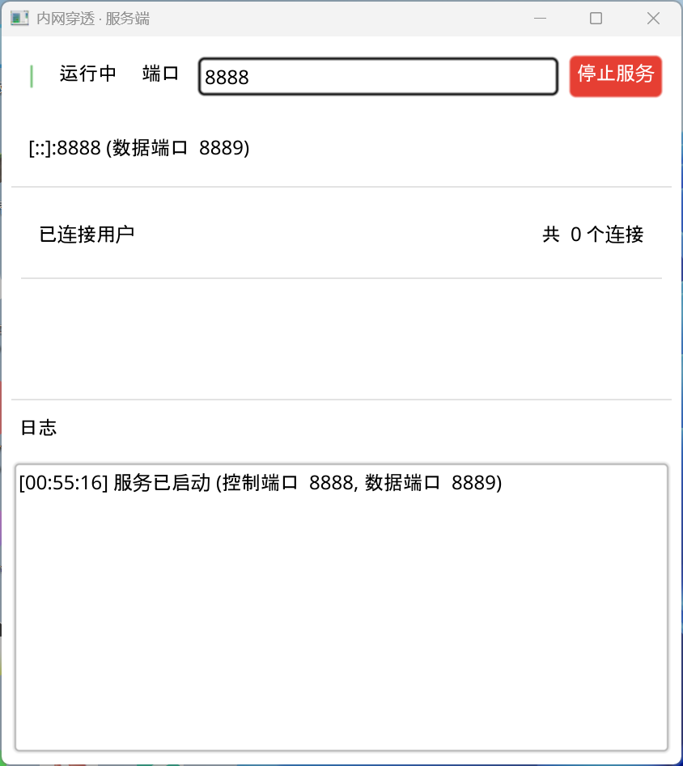
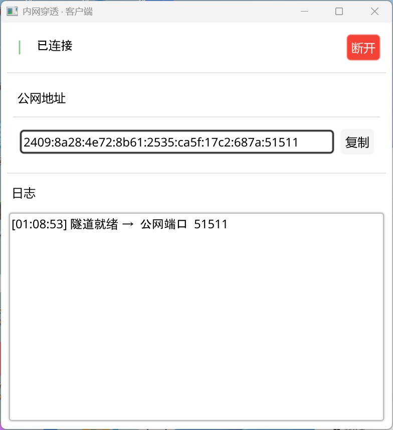
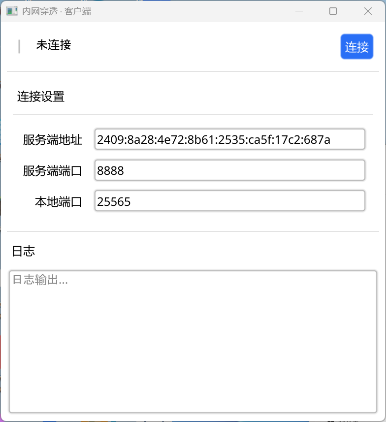

# IPv6 内网穿透工具

基于 Go 和 Fyne GUI 的轻量级内网穿透工具，提供简洁的图形界面，原生支持 IPv6 双栈。

## 功能特性

- 🖥️ **原生 GUI 界面**：使用 Fyne 框架，无 WebView 依赖，单文件 exe
- 🔄 **双向穿透**：服务端分配公网端口，客户端连接后建立隧道
- 🌐 **IPv6 原生支持**：直接输入 IPv6 地址自动格式化，服务端监听 `[::]` 双栈
- 🔁 **自动重连**：客户端意外断开后自动重连，手动断开不重连
- 🔒 **并发安全**：服务端全面加锁（sync.RWMutex），多人同时连接不崩溃
- ⏱️ **连接超时**：客户端 5 秒握手超时、服务端 10 秒数据超时，防止僵死连接
- 🧹 **资源清理**：连接关闭时正确释放所有 socket 和 listener
- 📋 **连接状态可视化**：每个客户端单条显示，实时刷新
- 🎨 **应用图标**：霓虹扳手风格，任务栏与文件管理器均显示

## 版本历史

| 版本 | 日期 | 说明 |
|------|------|------|
| v1.0.3 | 2026-05-24 | 修复原生 IPv6 地址连接失败（自动加方括号） |
| v1.0.2 | 2026-05-24 | 添加应用图标（霓虹扳手） |
| v1.0.1 | 2026-05-24 | 修复服务端用户列表重复显示 |
| v1.0.0 | 2026-05-24 | 稳定版：自动重连、并发安全、超时、资源清理 |

## 架构

```
+----------------+       +----------------+       +----------------+
|   本地服务     |<----->| 客户端 (GUI)   |<----->| 服务端 (GUI)   |
| (127.0.0.1:80) |       | (连接设置)     |       | (公网端口)     |
+----------------+       +----------------+       +----------------+
                                                         |
                                                         v
                                                 +----------------+
                                                 |   外部客户端   |
                                                 | (公网IP:端口)  |
                                                 +----------------+
```

## 快速开始

### 1. 下载

从 [Releases](https://github.com/taose4874/ipv6-tunnel/releases) 下载最新版：
- `IPv6服务端.exe`：运行在公网服务器
- `IPv6客户端.exe`：运行在内网设备

### 2. 编译

确保已安装 Go 1.21+ 和 MinGW-w64 GCC：

```bash
# 服务端
cd cmd/server-gui
go build -ldflags="-H windowsgui" -o IPv6服务端.exe

# 客户端
cd cmd/client-gui
go build -ldflags="-H windowsgui" -o IPv6客户端.exe
```

### 3. 运行服务端

1. 启动 `IPv6服务端.exe`
2. 设置监听端口（默认 8888）
3. 点击「启动服务」

### 4. 运行客户端

1. 启动 `IPv6客户端.exe`
2. 填写服务端地址（IPv4 或 IPv6 均可，IPv6 无需手动加方括号）
3. 设置本地服务地址（如 `127.0.0.1:80`）
4. 点击「连接」

### 5. 访问内网服务

外部客户端通过 `服务端IP:分配的公网端口` 即可访问内网服务。

## 项目结构

```
intranet-pen/
├── cmd/
│   ├── server-gui/     # 服务端 GUI（含图标资源）
│   └── client-gui/     # 客户端 GUI（含图标资源）
├── pkg/common/         # 公共协议定义
└── README.md
```

## 协议说明

- **控制端口**：服务端监听端口，用于注册和心跳
- **数据端口**：控制端口+1，用于转发数据
- **公网端口**：服务端动态分配，外部客户端连接此端口

消息类型：
- `MsgRegister`：客户端注册隧道
- `MsgRegistered`：服务端确认注册
- `MsgNewConn`：新外部连接通知
- `MsgConnReady`：客户端准备转发数据
- `MsgPing/Pong`：心跳保活

## UI 界面

### 服务端运行中



### 客户端已连接



### 客户端未连接



## 技术栈

- **语言**: Go 1.21
- **GUI 框架**: [Fyne](https://fyne.io/) v2.7.4
- **网络**: 标准库 `net`，IPv6 双栈，`net.JoinHostPort` 自动格式化
- **编译**: CGO_ENABLED=1，`-H windowsgui` 无控制台窗口
- **图标**: `windres` 编译 `.rc` → `.syso` 嵌入

## 注意事项

1. **防火墙**：确保服务端端口在防火墙中开放
2. **IPv6 地址**：客户端输入原生 IPv6 地址即可，程序自动添加方括号，无需手动输入 `[::]` 格式
3. **GCC 依赖**：Windows 编译需要 MinGW-w64 GCC（用于 CGO 和资源编译）
4. **连接超时**：客户端握手 5 秒超时，避免卡死
5. **自动重连**：意外断开后每 3 秒自动重连，手动断开不重连

## 许可证

MIT License